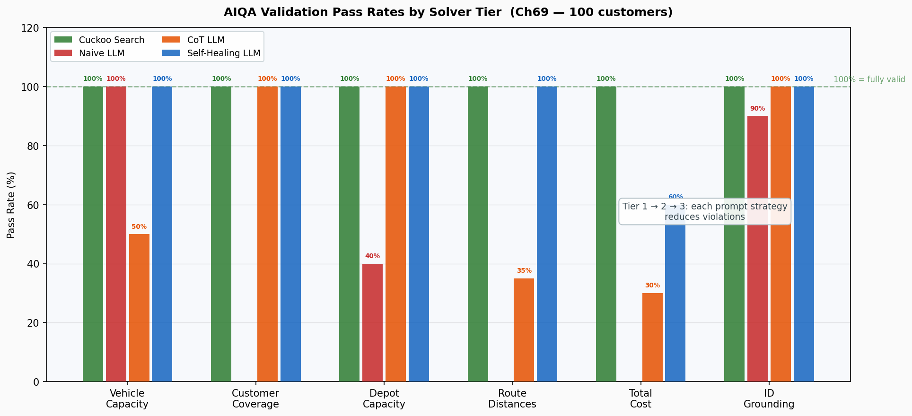
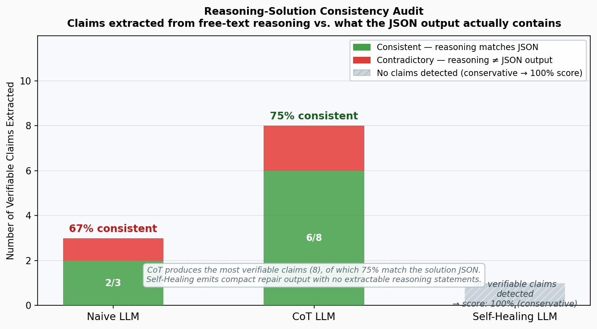

<div align="center">

# AIQA: Production-Grade Validity Framework for LLM Constrained Optimization

### Can an LLM produce feasible solutions to NP-hard routing problems — and how do you prove it?

[](https://www.python.org/downloads/)
[](https://www.anthropic.com/)
[](https://pytest.org/)
[](https://docs.confident-ai.com/)
[](https://docs.ragas.io/)
[](https://github.com/Konoszaf1/LRPSolverAIQA/actions)
[](https://docs.astral.sh/uv/)
[](https://github.com/Konoszaf1/LRPSolverAIQA/blob/main/LICENSE)

</div>

---

## The Problem

The **Location-Routing Problem (LRP)** is a classical NP-hard optimization problem. Given a set of customers with demands and a set of candidate depots with fixed opening costs, the goal is to decide which depots to open and how to route vehicles from those depots to serve every customer, minimizing total cost subject to hard capacity constraints.

Ask an LLM to solve a 100-customer instance and it returns well-formatted JSON with step-by-step reasoning. On the surface it looks correct. Run automated validation and a different picture emerges: customers are silently dropped, vehicle capacity limits are exceeded by 40%, and stated route distances are numerically fabricated.

<div align="center">

| Check | Cuckoo Search | Naive LLM |
|---|:---:|:---:|
| Valid JSON | Yes | Yes |
| Coherent reasoning | N/A | Yes |
| All customers served | Yes | No |
| Vehicle capacity respected | Yes | No |
| Distances correct | Yes | No |
| Depot capacity respected | Yes | No |

</div>

None of these failures are visible without automated validation. A human reviewer looking at well-structured JSON and plausible cost numbers would likely sign off on it.


*All four panels use the same 21-customer, 5-depot instance (Gaskell67). Red x markers are dropped customers (coverage violation). The thick red halo marks a single route overloaded beyond vehicle capacity. In the Naive LLM panel, Depot 5 at the bottom of the map serves northern customers while Depot 2 at the top serves southern customers, producing visible crossing routes and inflated total cost.*

---

## What This Project Does

This project builds a **production-grade validation framework** for LLM-generated solutions to constrained optimization problems. It runs three tiers of LLM solver (Anthropic Claude) against standard OR benchmark instances (8–150 customers), validates every solution through the same deterministic pipeline, and profiles **where LLM feasibility breaks down** as problem complexity scales.

A classical **Cuckoo Search** metaheuristic serves as the validity reference. It builds an initial population via nearest-neighbour assignment, then optimizes with Levy flights, inter-depot transfers, and 2-opt local search. By construction it always produces feasible solutions, providing a cost baseline against which valid LLM outputs are measured.

The three LLM tiers are designed to isolate where and why LLMs lose feasibility, and whether structured prompting and validator feedback loops can restore it:

| Tier | Strategy | Typical outcome on large instances |
|------|----------|------------------------------------|
| 1 | Naive zero-shot | Customers dropped, capacity breached, distances invented |
| 2 | Chain-of-Thought with nearest-neighbour guidance | Full coverage, but capacity and distance errors persist |
| 3 | Self-healing: CoT + validator feedback loop (max 3 retries) | Near-passing on most checks for instances up to ~100 customers |

**Benchmark results (Ch69, 100 customers):**

| Solver | Validators passed |
|--------|:-----------------:|
| Cuckoo Search | 5 / 5 |
| Naive LLM | 2 / 6 |
| CoT LLM | 3 / 6 |
| Self-Healing LLM | 5 / 6 |

---

## What Happens on a Harder Instance

The Gaskell67 figure above (21 customers) shows self-healing recovering to a passing solution. Scale up to Ch69 (100 customers, 10 depots) and self-healing runs out of rope: after three repair cycles the model still cannot compute correct Euclidean distances, so both the route-distance and total-cost validators remain red.


*Same layout as above, 5x the customers. The CS panel (top-left) has 14 compact routes across all 10 depots. The Naive LLM panel (top-right) shows 18 red x markers for dropped customers and routes that cross the entire map diagonally. The Self-Healing panel (bottom-right) has correct geometry -- the routes look identical to CS -- but the model's stated distance totals are wrong, which the validators catch.*

---

## Validation Pass Rates by Tier



Each group shows one solver. Bars within a group represent validators, colour-coded consistently. This layout reveals feasibility at a glance: Naive LLM fails four validators, CoT recovers coverage but fails distances, Self-Healing closes most gaps except total cost. On 100-customer instances, Naive fails route distance and total cost checks entirely.

**Data flow:** A benchmark instance feeds into all four solvers in parallel. Every resulting solution then passes through the same AIQA pipeline: 5 deterministic validators, a faithfulness and ID-grounding check, metamorphic perturbation tests, DeepEval metric wrappers, and a dashboard report. The Self-Healing solver is the only one that reads validator output before it is finalized.

---

## The Multi-Tier LLM Approach

### Tier 1: Naive (Zero-Shot)

Minimal prompt: provide the instance data and ask for a JSON solution. No routing hints, no capacity reminders. This tier shows what an LLM does by default. On small instances (8 customers) it often passes. On larger ones it consistently drops customers and fabricates distances.

### Tier 2: Chain-of-Thought with Heuristic Guidance

The prompt walks the LLM through a nearest-neighbour assignment strategy and asks it to track remaining capacity at each step. Route structure improves, coverage errors mostly disappear, but distance calculations remain wrong. The model narrates correct-sounding arithmetic that does not match Euclidean geometry.

### Tier 3: Self-Healing Agent

After the initial CoT attempt, the solution is validated. If any of the 5 checks fail, a repair prompt is built that includes the exact violations as text, and the model is asked to fix them. This loop runs up to 3 times. The approach treats the validator as a runtime feedback signal rather than a post-hoc test, which is how LLMs can be used safely in optimization pipelines.

---

## The AIQA Validation Suite

Every solution — regardless of source — passes through the same validation pipeline. The primary question is feasibility: **does this solution satisfy all hard constraints?** Cost efficiency is measured only for solutions that first pass the validity gate.

| Layer | What it checks | What it catches |
|-------|---------------|-----------------|
| Vehicle capacity | Sum of demand on each route vs. vehicle limit | Routes that exceed per-vehicle load |
| Customer coverage | Every customer ID in the instance appears in exactly one route | Dropped or duplicated customers |
| Depot capacity | Aggregate demand routed through each depot vs. depot limit | Depot overloads |
| Route distances | Recomputed Euclidean distance vs. stated distance (5% tolerance) | Fabricated distance values |
| Total cost | Recomputed depot fixed costs + route distances vs. stated total | Wrong objective value |
| ID grounding / faithfulness | Every ID in the solution exists in the input; RAGAS scoring | Phantom customers and depots |
| Metamorphic tests | Perturb the instance (scale demands, remove customers, jitter coordinates) and check that solution quality changes in the expected direction | Logical inconsistencies that pass individual checks |

The DeepEval layer wraps these checks as `BaseMetric` objects so the full suite runs in pytest with CI-compatible pass/fail output.

### Soft Scoring: Continuous Severity Measurement

Binary pass/fail validators tell you *whether* a constraint was broken.  The soft-scoring layer tells you *by how much* — transforming discrete test outcomes into a continuous signal suitable for statistical reasoning across stochastic LLM runs.

Each soft scorer mirrors its binary counterpart but returns a **severity** value (0.0 = no violation, unbounded positive = worse):

| Validator | Severity metric | Example |
|-----------|----------------|---------|
| Vehicle capacity | Max fractional overshoot across routes | 0.15 = worst route exceeds capacity by 15% |
| Customer coverage | (missing + duplicated + phantom) / total customers | 0.20 = 20% of customers are wrong |
| Depot capacity | Max fractional overshoot across depots | 0.30 = worst depot is 30% overloaded |
| Route distances | Mean relative error |stated − actual| / actual | 0.25 = routes are 25% off on average |
| Total cost | Relative error |stated − recomputed| / recomputed | 0.10 = total cost is 10% wrong |

The `score_all()` function runs all five soft scorers in a single call and returns a `SoftScoreReport` with per-validator breakdowns and an aggregate `max_severity` — the worst violation magnitude across all five dimensions.  This is the primary metric consumed by the Monte Carlo profiler.

**14 unit tests** with precise numeric assertions (e.g., "15% overshoot when load=184 against capacity=160") validate every severity calculation — the most rigorous testing in the repository.


Each cell shows the exact severity value. CS is the zero baseline - all cells 0.00. Naive LLM shows worst failures in customer coverage (0.25) and route distances (0.45). Self-Healing's repair loop reduces severity to near-zero even when binary validators still fail.

```bash
uv run pytest qa_suite/deterministic_checks/test_soft_scoring.py -v
```

### Metamorphic Testing: Property-Based Robustness

Deterministic validators check a single solution against known constraints. Metamorphic tests check whether the solver behaves *consistently* across related inputs — without needing the correct answer for either.

The idea: apply a semantically meaningful perturbation to the input, solve both original and perturbed instances, and assert a **metamorphic relation** that must hold between the two outputs:

| Perturbation | Metamorphic relation | Reasoning |
|-------------|---------------------|-----------|
| Vehicle capacity x1.5 | `perturbed_cost <= original_cost + 15%` | More capacity per vehicle means fewer routes needed |
| Double all demands | `perturbed_routes >= original_routes` | Each vehicle fills twice as fast |
| Zero all fixed costs | `perturbed_depots >= original_depots` | No penalty for opening more depots |
| Remove 50% of customers | `perturbed_cost <= original_cost + 15%` | Fewer customers to serve means lower total distance |

These tests catch a class of failure that individual validators miss: an LLM that passes every constraint check on each instance individually but violates *logical consistency* between related instances. A solver that produces a higher cost when given more vehicle capacity is fundamentally unreliable, even if both solutions are technically feasible.

The 15% tolerance accounts for LLM stochasticity — the relation must hold directionally, not exactly.

```bash
# Requires ANTHROPIC_API_KEY — runs 8 LLM calls (2 per perturbation)
uv run pytest qa_suite/metamorphic_tests/test_metamorphic.py -v -s -m "llm and metamorphic"
```

### Faithfulness and ID Grounding (RAGAS)

LLM solutions can reference customer IDs and depot IDs that don't exist in the input data — **phantom entities** that look plausible but are fabricated. The faithfulness layer catches this at two levels:

**Manual ID grounding (0 API calls):** Every customer ID and depot ID in the solution is checked against the input dataset. Phantom IDs produce a score below 1.0. This runs on every solution in the benchmark pipeline and the demo showcase.

**RAGAS faithfulness scoring (1 API call):** Uses the [RAGAS](https://docs.ragas.io/) framework to evaluate whether the solution's claims are grounded in the retrieved context (the instance data). The LLM solution JSON is treated as the `response`, and the raw problem data as `retrieved_contexts`. This catches subtler grounding failures — not just wrong IDs, but claims about distances or assignments that aren't supported by the input.

```bash
# Manual faithfulness only (uses ANTHROPIC_API_KEY for solving, not evaluation)
uv run pytest qa_suite/ragas_tests/test_faithfulness.py::test_manual_faithfulness -v -s -m llm

# Full RAGAS evaluation (additionally requires OPENAI_API_KEY for the evaluator LLM)
uv run pytest qa_suite/ragas_tests/test_faithfulness.py -v -s -m llm
```

---

## Beyond Deterministic: Five Targeted Reliability Modules

Deterministic tests catch single-run failures. The analysis layer goes deeper — each module answers a specific question about LLM solver **reliability** with minimal API calls. Two modules require zero API calls (pure Python); three use the LLM strategically (20 calls total vs. 30+ for brute-force Monte Carlo).

### 1. Validity Structural Analysis (0 API calls)

Verifies that LLM solutions satisfy all hard constraints (capacity, coverage, depot limits). For valid solutions, measures cost efficiency relative to Cuckoo Search as a reference point using three structural metrics:

- **Feasibility verdict** — does the solution pass all 5 deterministic validators?
- **Cost gap percentage** — for valid solutions, how much more expensive vs. CS?
- **Depot overlap (Jaccard index)** — does the LLM open the same depots?

Cost premium (typically +12-18%) is acceptable for fast, on-demand solving vs. extended metaheuristic optimization.

```bash
uv run python -m qa_suite.deterministic_checks.optimality_gap \
    results/Srivastava86.json --strategy cot
```

### 2. Reasoning-Solution Consistency Audit (0 API calls)

Parses the free-text `reasoning` field and extracts verifiable claims — customer assignments, demand tallies, distance values, customer counts — then checks each against the actual JSON output.

This catches a failure mode no other validator tests: the LLM narrates a correct strategy but emits different JSON. The reasoning *sounds* right but describes a different solution than the one produced. Conservative by design: `consistency_score = 1.0` when no claims are detected.



CoT produces the most verifiable claims (8) because its prompt asks for step-by-step reasoning. 75% match the actual JSON output. Self-Healing emits compact repair output with no extractable statements - the conservative 100% score means "not falsified", not "verified correct".

```bash
uv run python -m qa_suite.deterministic_checks.reasoning_audit \
    results/Srivastava86.json
```

### 3. Adversarial Impossibility Detection (3 API calls)

Constructs three mathematically unsatisfiable LRP instances and tests whether the LLM detects the impossibility or hallucinates a "solution":

| Scenario | Modification | Expected LLM response |
|----------|-------------|----------------------|
| Overcapacity | All demands × 10 | Detect infeasibility |
| Unservable customer | One demand > vehicle capacity | Detect infeasibility |
| Insufficient depot | Single depot at 30% of total demand | Detect infeasibility |

Each response is classified as **detected** (correct), **hallucinated** (produced JSON ignoring the constraint), or **error** (parse failure).


Self-Healing detects all three impossible instances. The validator feedback loop trains the model to question its feasibility. Naive hallucinates solutions for the two capacity-violation scenarios, producing JSON that ignores the mathematical impossibility.

```bash
uv run python -m qa_suite.adversarial.impossible_instances \
    --instance Srivastava86 --strategy cot
```

### 4. Validity Breakpoint Analysis (12 API calls)

Instead of running the same instance 30 times, run each strategy **once** across instances of increasing size: Srivastava86 (8), Gaskell67 (21), Perl83 (55), Ch69 (100). Each call produces a distinct data point on the validity scaling curve.

This answers: **at what instance size does each strategy lose feasibility, and how severe are the violations?** A Cuckoo Search baseline is computed alongside (zero API cost) as a validity reference — CS achieves 100% validity at all sizes.

```bash
uv run python -m qa_suite.probabilistic.scaling_analysis --strategies all
```

Output: two-panel validity breakpoint chart — validity pass rate (%) vs instance size as a step chart (top), and max severity at failure points (bottom), one line per strategy.

### 5. Prompt Format Sensitivity Analysis (5 API calls)

Tests whether solution quality is sensitive to cosmetic changes in how the same data is presented. Five formatting variants of the same instance:

| Variant | Change |
|---------|--------|
| `default_order` | Standard format (ascending ID) |
| `demand_descending` | Customers sorted by demand, highest first |
| `distance_from_centroid` | Customers sorted by distance from centroid |
| `depots_first` | Depot section printed before customers |
| `swapped_xy_labels` | Column headers say Y before X (data unchanged) |

If results diverge across variants, the model is fragile to prompt layout rather than reasoning about the problem.

```bash
uv run python -m qa_suite.probabilistic.prompt_sensitivity \
    --instance Srivastava86 --strategy cot
```

Output: heatmap grid (validators × variants, colour-coded by severity).

### Why This Matters

| Test type | What it reveals | API calls |
|-----------|----------------|:---------:|
| Deterministic | "This specific solution violates hard constraints" | 0 |
| Soft scoring | "Capacity exceeded by 15%, not just 'fails'" | 0 |
| Validity analysis | "Solution is feasible; cost premium +14% vs. CS reference" | 0 |
| Reasoning audit | "LLM narrated correct steps but emitted wrong JSON" | 0 |
| Adversarial | "LLM hallucinated a solution to an impossible problem" | 3 |
| Validity breakpoints | "CoT maintains validity to 55 customers; self-healing extends to 100" | 12 |
| Prompt sensitivity | "Reordering columns changed the answer completely" | 5 |

Each module produces a distinct finding that repetition cannot provide. Together they profile LLM solver **reliability** across dimensions — feasibility boundaries, violation severity, format sensitivity, impossibility detection, and reasoning fidelity — while keeping API costs predictable (20 calls total).

### Validity Reliability Profile


**Top panel - Validity pass rate:** Naive loses all feasibility by 21 customers. CoT holds 100% on small instances, falls at 55. Self-Healing extends furthest through repair loops, maintaining validity to 55 and reaching 60% at 100.

**Bottom panel - Severity at breakpoints:** When validity fails, severity shows how bad the violation is. Naive violations are severe (coverage gaps, fabricated distances - 0.30+). CoT failures are milder, typically arithmetic errors (0.08-0.15). Self-Healing failures are near the 5% threshold - repair loops reduce severity almost to zero before retries exhaust.

**Key finding:** Each tier extends the feasibility boundary. Cost premium for valid LLM solutions (typically +12-18%) is acceptable for on-demand solving vs. extended metaheuristic optimization.

```bash
# Reproduce this chart with real API calls
uv run python -m qa_suite.probabilistic.scaling_analysis --strategies all
```

---

## CI/CD Pipeline

GitHub Actions runs a two-stage pipeline on every push and pull request:

| Stage | Requires API key | What runs |
|-------|:---:|------|
| **Deterministic** | No | Ruff lint, mypy type check, Cuckoo Search validation tests, soft scoring tests |
| **LLM** | Yes | All 3 LLM strategy tests (naive, CoT, self-healing) |

Results are uploaded as artifacts. The LLM stage only runs when the `ANTHROPIC_API_KEY` secret and `RUN_LLM_TESTS` variable are configured in the repository settings. The `RUN_LLM_TESTS` variable gate is cleaner than a secret-existence check and makes the pipeline's behaviour explicit.

---

## Quickstart

### Prerequisites

- Python 3.11+
- [uv](https://docs.astral.sh/uv/)
- Anthropic API key (for LLM tiers only)

### Install

```bash
git clone https://github.com/Konoszaf1/LRPSolverAIQA.git && cd LRPSolverAIQA
uv sync
```

### Interactive demo

Runs all four solvers on two random instances and prints a side-by-side validation table:

```bash
# PowerShell
$env:ANTHROPIC_API_KEY="sk-ant-..."
uv run python demo_showcase.py

# or pass the key directly
uv run python demo_showcase.py --api-key sk-ant-...

# specific instances
uv run python demo_showcase.py --instances Gaskell67 Ch69
```

### Full benchmark

```bash
# single instance (default: Srivastava86)
uv run python run_benchmark.py

# all instances, all three LLM tiers
uv run python run_benchmark.py --all --strategy all

# self-healing tier only
uv run python run_benchmark.py --strategy self_healing
```

### Tests

```bash
# deterministic checks, no API key required
uv run pytest qa_suite/deepeval_tests/test_deterministic.py -v

# soft scoring tests (precise severity assertions)
uv run pytest qa_suite/deterministic_checks/test_soft_scoring.py -v

# LLM tests, all three tiers (requires ANTHROPIC_API_KEY)
uv run pytest -m llm -v -s

# regenerate README images
uv run python generate_readme_images.py

# dashboard report
uv run python -m dashboard.report_generator
```

---

## Benchmark Datasets

Classical OR instances in `DATALRP/DATALRP/`:

| Instance | Customers | Depots | Source |
|----------|:---------:|:------:|--------|
| Srivastava86 | 8 | 2 | Srivastava (1986) |
| Gaskell67 | 21 | 5 | Gaskell (1967) |
| Perl83 | 55 | 15 | Perl (1983) |
| Ch69 | 100 | 10 | Christofides (1969) |
| Or76 | 117 | 14 | Or (1976) |
| Min92 | 134 | 8 | Min (1992) |
| Daskin95 | 150 | 10 | Daskin (1995) |

---

## Project Structure

```
lrp/                              # Core LRP solver package
  config.py                       #   Vehicle capacity, CuckooConfig dataclass
  models/                         #   Node, Distance, Solution, VehicleRoute
  io/data_loader.py               #   Benchmark file parsers
  algorithms/                     #   Cuckoo Search, nearest neighbor, 2-opt
  visualization.py                #   Route plotting (matplotlib)

ai_agent/                         # Multi-tier LLM solver
  solver.py                       #   LLMSolver + SolveStrategy enum + self-healing loop
  prompt_templates.py             #   3 prompt tiers: naive, CoT, repair

qa_suite/                         # AIQA validation framework
  common/                         #   Shared fixtures, schemas, adapters, faithfulness
  deterministic_checks/           #   5 validators + soft scoring + optimality gap + reasoning audit
  deepeval_tests/                 #   DeepEval BaseMetric wrappers + pytest integration
  metamorphic_tests/              #   Perturbation functions + metamorphic test suite
  adversarial/                    #   Impossibility detection (unsolvable instances)
  probabilistic/                  #   Scaling analysis, prompt sensitivity
  ragas_tests/                    #   RAGAS faithfulness evaluation

.github/workflows/                # CI/CD
  aiqa_pipeline.yml               #   Two-stage deterministic + LLM pipeline

observability/                    # Arize Phoenix OTEL tracing setup
dashboard/                        # Benchmark report generator
generate_readme_images.py         # Regenerates docs/images/ from real solver output
demo_showcase.py                  # 4-solver Rich terminal UI demo
run_benchmark.py                  # Master benchmark CLI
```

---

## Tech Stack

| | Technology |
|---|---|
| Runtime | Python 3.11+ with uv |
| LLM | Anthropic Claude (Sonnet / Haiku) |
| Solution schemas | Pydantic v2 with cross-field validation |
| QA metrics | DeepEval BaseMetric wrappers |
| Faithfulness | RAGAS + manual ID-grounding checks |
| Soft scoring | Continuous severity measurement (fractional overshoot, relative error) |
| Observability | Arize Phoenix (OTEL traces) |
| Terminal UI | Rich |
| Retry | Tenacity with exponential backoff |
| Probabilistic QA | Scaling curves, prompt sensitivity, adversarial detection |
| CI/CD | GitHub Actions (two-stage pipeline) |
| Plotting | Matplotlib |
| Code quality | Ruff + mypy |

---

## Author

**Konstantinos Zafeiris**
