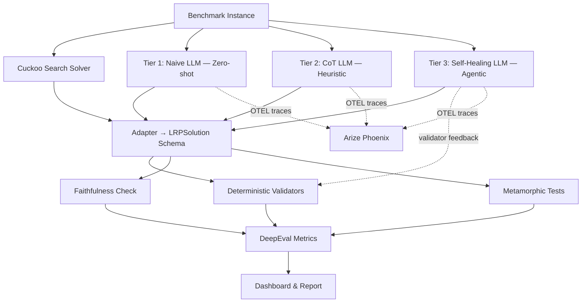

# AIQA: AI Quality Assurance for LLM Mathematical Optimization

> *Can an LLM solve a 100-customer vehicle routing problem? Spoiler: it can't. But it doesn't know that.*

[](https://www.python.org/downloads/)
[](LICENSE)
[](https://github.com/yourusername/LRPSolver/actions)
[](https://docs.astral.sh/ruff/)
[](https://mypy-lang.org/)

## Why This Matters

Large Language Models produce solutions to constrained optimization problems that **look** correct — valid JSON, plausible cost numbers, coherent reasoning. A human reviewer would likely accept these outputs at face value.

But when you run automated validation on a 100-customer Location-Routing Problem, the QA pipeline reveals that the LLM **silently violates hard constraints**: customers are missed, distances are fabricated, and capacity limits are breached. None of this is visible without systematic verification.

This project is a **Multi-Solver Benchmarking & Validation Framework** that pits a classical Cuckoo Search metaheuristic against an LLM (Claude) on standard OR benchmark instances, then validates both outputs through a comprehensive AIQA pipeline. It demonstrates why AI Quality Assurance is essential when deploying LLMs for mathematical optimization.

## Architecture



### Multi-Tier LLM Strategy

| Tier | Strategy | Concept | Expected Outcome |
|------|----------|---------|-----------------|
| **1** | Naive (Zero-shot) | Basic prompt, no heuristic hints | High failure rate — baseline |
| **2** | CoT + Heuristic | Chain-of-Thought with nearest-neighbour routing guidance | Better formatting, still some math hallucinations |
| **3** | Self-Healing Agent | CoT + iterative validator-feedback repair loop (max 3 retries) | Highest success rate — QA-driven agentic workflow |

## Quick Start

```bash
# 1. Clone
git clone https://github.com/yourusername/LRPSolver.git && cd LRPSolver

# 2. Install dependencies
uv sync

# 3. Run the showcase demo
# PowerShell:
$env:ANTHROPIC_API_KEY="sk-ant-..."
uv run python demo_showcase.py
# Or pass the key directly:
uv run python demo_showcase.py --api-key sk-ant-...
```

## Project Structure

```
lrp/                          # Core LRP solver package
  config.py                   #   Vehicle capacity, CuckooConfig dataclass
  models/                     #   Node, Distance, Solution, VehicleRoute
  io/data_loader.py           #   Benchmark file parsers
  algorithms/                 #   Cuckoo Search, nearest neighbor, 2-opt
  visualization.py            #   Route plotting (matplotlib)

ai_agent/                     # Multi-tier LLM solver
  solver.py                   #   LLMSolver + SolveStrategy enum + self-healing loop
  prompt_templates.py         #   3 prompt tiers: naive, CoT, repair

qa_suite/                     # AI Quality Assurance framework
  common/                     #   Shared fixtures, schemas, adapters, faithfulness
  deterministic_checks/       #   5 validators (capacity, coverage, distance, cost, depot)
  deepeval_tests/             #   DeepEval BaseMetric wrappers + pytest tests
  metamorphic_tests/          #   Perturbation functions + metamorphic test suite
  ragas_tests/                #   RAGAS faithfulness evaluation

observability/                # Arize Phoenix OTEL tracing setup
dashboard/                    # Benchmark report generator
demo_showcase.py              # Interactive demo with rich terminal UI
run_benchmark.py              # Master benchmark CLI
```

## QA Pipeline

| Layer | Technique | What It Catches |
|-------|-----------|-----------------|
| **Deterministic Validators** | Vehicle capacity, customer coverage, depot capacity, route distances, total cost recomputation | Hard constraint violations |
| **Faithfulness Check** | ID grounding — every customer/depot ID must exist in the input | Hallucinated node IDs |
| **Metamorphic Testing** | Demand scaling, customer removal, depot cost perturbation, coordinate jitter | Logical inconsistencies under perturbation |
| **DeepEval Metrics** | BaseMetric wrappers for all validators | CI-compatible metric reporting |
| **RAGAS Evaluation** | Faithfulness scoring against retrieved context | Ungrounded claims in reasoning |
| **Observability** | Arize Phoenix with OTEL traces | Latency, token usage, error rates |

## Running Tests

```bash
# Deterministic tests (no API key needed)
uv run pytest qa_suite/deepeval_tests/test_deterministic.py -v

# LLM tests — all 3 tiers (requires ANTHROPIC_API_KEY)
$env:ANTHROPIC_API_KEY="sk-ant-..."
uv run pytest -m llm -v -s

# Full benchmark with all 3 LLM strategies
uv run python run_benchmark.py --all --strategy all

# Generate report
uv run python -m dashboard.report_generator
```

## Benchmark Results (Sample)

| Instance | Customers | CS | Naive LLM | CoT LLM | Self-Healing LLM |
|----------|-----------|-------|-----------|---------|------------------|
| Srivastava86 | 8 | 5/5 ✓ | 6/6 ✓ | 6/6 ✓ | 6/6 ✓ |
| Ch69 | 100 | 5/5 ✓ | 2/6 ✗ | 3/6 ✗ | 5/6 ✓ |

Each tier progressively reduces constraint violations. The Self-Healing agent uses validator feedback to fix its own mistakes — demonstrating the power of QA-driven agentic workflows.

## Problem Overview

The **Location-Routing Problem (LRP)** combines two classical optimization challenges:
1. **Facility Location**: Which depots to open (minimizing fixed costs)
2. **Vehicle Routing**: How to route vehicles through assigned customers (minimizing travel distance)

**Objective**: Minimize total cost = depot fixed costs + route distances, subject to vehicle capacity, depot capacity, and full customer coverage constraints.

## Benchmark Datasets

Classical OR instances in `DATALRP/DATALRP/`:

| Instance | Customers | Depots | Source |
|----------|-----------|--------|--------|
| Srivastava86 | 8 | 2 | Srivastava (1986) |
| Gaskell67 | 21 | 5 | Gaskell (1967) |
| Perl83 | 55 | 15 | Perl (1983) |
| Ch69 | 100 | 10 | Christofides (1969) |
| Or76 | 117 | 14 | Or (1976) |
| Min92 | 134 | 8 | Min (1992) |
| Daskin95 | 150 | 10 | Daskin (1995) |

## Tech Stack

- **Python 3.11+** with **uv** package manager
- **Anthropic Claude** (Sonnet) for LLM solving
- **Pydantic v2** for solution schemas with cross-field validation
- **DeepEval** for metric-driven test evaluation
- **RAGAS** for faithfulness scoring
- **Arize Phoenix** for LLM observability (OTEL traces)
- **Rich** for terminal UI
- **Tenacity** for API retry with exponential backoff
- **Ruff** + **mypy** for code quality
- **GitHub Actions** for CI/CD

## Cuckoo Search Algorithm

The classical solver uses **Cuckoo Search**, a nature-inspired metaheuristic:
- Generates initial solutions via nearest-neighbour heuristic
- Applies Levy flights for adaptive step-size control
- Uses global search (cross-depot customer transfers) and local search (2-opt route reordering)
- Implements probabilistic solution abandonment to escape local optima

## Author

Konstantinos Zafeiris
